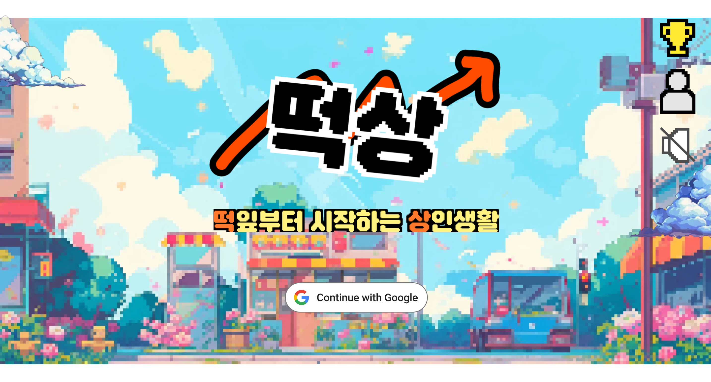
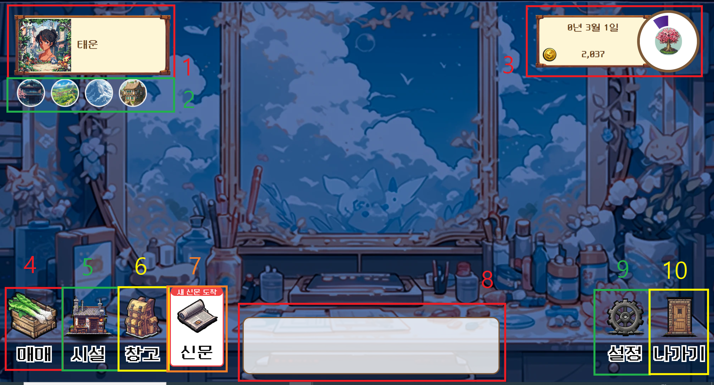
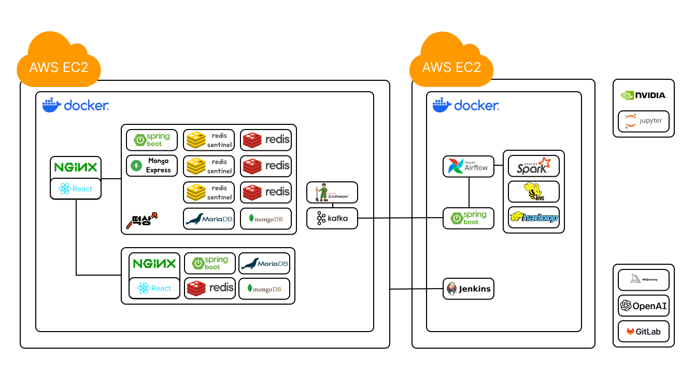

# 떡상 : 떡잎부터 시작하는 상인생활

---

# 목차

---

1. [개요](#1-개요)
2. [개발 환경](#2-개발-환경)
3. [플레이 방법](#3-플레이-방법)
4. [주요 기능](#4-주요-기능)
5. [기술 소개](#5-기술-소개)
6. [설계 문서](#6-설계-문서)
7. [팀원 소개](#7-팀원-소개)

# 1. 개요

---

## 프로젝트 소개

### 떡상 : 떡잎부터 시작하는 상인 생활

[떡상 홈페이지 바로가기(https://tteoksang.me/)](https://tteoksang.me/)

-   떡잎부터 시작하는 상인 생활, **"떡상"**은 농산물 도매상으로 활동하며 실시간으로 주어지는 정보를 바탕으로 시세를 예측하고, 작물을 매매해 수입을 늘리는 **경영 시뮬레이션 게임**입니다.
-   플레이어는 실시간으로 갱신되는 농산물 가격 정보를 기반으로 농산물을 매매해 최대의 수익을 얻어야 합니다.
-   농산물 가격 정보나 변동을 주는 이벤트는 실제 농산물, 뉴스 데이터에서 추출하였습니다.

### 기획 배경

-   빅 데이터 분산이라는 주제를 선정하고 다량의 데이터를 확보할 수 있는 분야가 있는지 찾아보다 농산물 데이터와 뉴스 데이터를 선정하게 되었습니다.
-   농산물이나 그와 관련된 뉴스를 제공하는 서비스는 기존에도 많이 있었기에 신선한 주제가 없나 생각하다 팀원 모두의 관심사인 게임을 만들자는 생각에 이르렀습니다.

### 타겟

-   게임을 좋아하는 모든 사람들

### 타 서비스와의 차별성과 특장점

| 항목      | 기존 경영 시뮬레이션 게임 | 떡상                      |
| --------- | ------------------------- | ------------------------- |
| 시나리오  | 정해진 시나리오           | 랜덤으로 변하는 가격 요소 |
| 실행 환경 | 로컬                      | 실시간 온라인             |
| 가격 정보 | 기획자가 의도한 설계      | 실제 가격 정보 기반 제공  |
| 이벤트    | 기획자가 구상한 결과      | 실제 뉴스 정보 기반 제공  |

-   기존 경영 시뮬레이션 게임은 일반적으로 로컬 환경에서 정해진 규칙과 시나리오에 따라 움직이지만, 저희 게임은 **실시간 온라인** 기반으로 서버에서 보내주는 랜덤한 가격 정보에 따라 움직입니다.
-   기존 경영 시뮬레이션에서 가격 정보나 이벤트는 랜덤하게 출현한다고 해도 기본적으로 기획자가 정한 범위나 이벤트에 따라 동작합니다. 저희 게임은 **빅데이터 분산 처리**를 통해 얻은 실제 가격 정보와 뉴스 정보, 가격 변동 내용에 따라 동작합니다.

---

# 2. 개발 환경

---

### Management Tool

### IDE

### Infra

### Frontend

### Backend

### Data

### 그 외

---

# 3. 플레이 방법

---

## 전체적인 플레이 방법

1. 먼저 게임에 로그인을 합니다.
2. 게임을 시작해 봅시다. 시작하기 버튼이나 이어하기 버튼을 눌러 게임에 접속합니다.
3. 게임에 접속했습니다. 이제 농작물을 사고 팔아 봅시다.
4. 매매 버튼을 눌러, 거래 모달을 키고, 농작물을 사고 팝니다. 방법은 간단합니다. **"싸게 사서 비싸게 팔기."**
5. 농작물의 가격 정보는 매 3분마다 갱신됩니다. 3분이 게임상의 하루에 해당합니다.
    - 이 게임은 게임상으로 총 9년의 시간이 지나면 한 개의 시즌이 끝납니다. 0년 3월 1일에 시작해 8년 2월 30일에 끝납니다.
    - 게임 시간 하루가 현실 시간 3분입니다.
    - 게임 시간 한달은 30일, 즉, 현실 시간으로 1시간 30분입니다.
    - 게임 시간 한 계절은 3달. 즉, 현실 시간으로 4시간 30분입니다.
    - 계절이 변화하면 분기나 반기 보고서가 날아옵니다.
    - 게임 시간으로 9년이 지나면 시즌이 종료됩니다. 그 후, 전체 정산 시간을 거쳐 새 시즌이 시작됩니다. 이 과정이 일주일 주기로 진행됩니다.
6. 시설 버튼을 누르면 시설 업그레이드가 가능합니다. 더 많은 아이템을 보관하고 싶으면 창고 업그레이드를, 더 많은 아이템을 한번에 구매하고 싶으면 운송 수단 업그레이드를, 판매 수수료를 낮추고 싶다면 거래소 업그레이드를 하세요.
7. 정기적으로 신문이 옵니다. 신문을 통해 앞으로 올 이벤트의 예측이 가능합니다. 작물 가격은 이벤트의 영향도 받으니 잘 읽어보시고 예측해 보세요^^.
8. 현재 적용중인 특수 이벤트의 확인도 가능합니다. 이벤트 정보를 보고 전략적인 매매를 합시다.
9. 매 계절이 끝나면 결산 정보가 옵니다. 현재 나의 상태를 확인해가며 진행합시다.
10. 게임도 너무 오래하면 안되겠죠? 오래 접속하면 경고창을 띄우고, 반기마다 9분씩 휴식 시간을 드립니다.
11. 게임이 끝나고 새 시즌이 시작되었습니다. 지난 시즌의 전체 결산 정보를 확인하고, 이 결과에 따라 새 시즌의 시작 자본금이 정해집니다. 열심히 한 분은 더 많은 자본을 가지고 시작하니 매우 유리하겠죠?

-   게임의 전반적 플레이는 위와 같이 진행됩니다. 이제 실제 화면을 보며 자세한 설명을 통해 구체적인 플레이 방법을 익혀봅시다.

## 플레이 화면 및 기능 설명

### 1. 로그인과 회원가입

-   먼저 게임에 로그인을 해봅시다.
-   저희 게임은 OAuth2 기반의 구글 로그인을 지원합니다.
-   구글 계정을 통해 회원가입을 하고 로그인을 진행해 봅시다.

### 2. 시작 화면

#### 첫 접속 시, 시즌 시작 시 화면

-   로그인을 하면 다음과 같은 화면이 나옵니다.
-   시작하기 버튼을 누르면 게임이 시작됩니다.
-   시즌 시작 후 첫 접속 시 다음 화면이 나옵니다.
-   마이페이지 버튼을 통해 마이페이지에 접속하실 수 있습니다.
-   소리를 키고 끌 수도 있습니다.

#### 첫 접속이 아니라면?

-   이번 시즌 내에 플레이 기록이 있다면 마지막 플레이 시간과 이어하기 버튼이 활성화 됩니다. 이 버튼을 누르면 게임을 이어서 할 수 있습니다.
-   만약 처음부터 다시 시작하고 싶으시다면? 새로 시작하기 버튼을 누르실 수 있습니다. 새로 시작할 경우 기존 정보는 모두 날아가니 신중하게 눌러주세요^^

### 3. 메인 화면

-   메인 화면입니다. 번호로 표시된 각 기능을 설명드리갰습니다.

1. 내 프로필
    - 나의 칭호와 닉네임, 현재 프로필 화면이 보이는 부분입니다.
    - 누르면 마이페이지를 보실 수 있습니다.
2. 테마 변경 - 풍경 변경
    - 창 밖의 풍경을 바꿀 수 있는 버튼입니다.
    - 원하시는 풍경으로 설정해 보세요!!!
3. 시간 및 소지금 표시
    - 현재 날짜, 소지금, 시간, 계절을 확인하실 수 있습니다.
    - 현재 턴이 얼마나 남았는지가 원형 타이머로 표시됩니다. 남은 시간 내에 신중히 물건을 사고 파세요^^.
4. 매매 버튼
    - 버튼을 누르면 거래 모달이 떠오릅니다.
    - 구매, 판매, 모든 제품의 시세 확인이 가능합니다.
    - 물건을 사고 팔거나, 전체적인 시세를 확인하시고 싶으시다면 이 버튼을 누르시기 바랍니다.
5. 시설 버튼
    - 버튼을 누르면 시설 모달이 떠오릅니다.
    - 현재 보유한 창고, 운송수단, 거래소의 업그레이드가 가능합니다.
    - 시설 레벨에 따라 사거나 보관 가능한 물건의 양, 거래소의 수수료가 달라집니다. 전략적인 업그레이드를 통해 더욱 큰 돈을 벌어봅시다^^
6. 창고 버튼
    - 버튼은 누르면 창고 모달이 떠오릅니다.
    - 현재 가진 품목들을 한번에 확인하실 수 있습니다.
7. 신문 버튼
    - 버튼을 누르면 신문 모달이 떠오릅니다.
    - 장사에 정보는 필수! 최근에 발행된 신문을 보고 앞으로의 이벤트를 예측해 전략적 투자를 합시다.
8. 채팅창
    - 실시간으로 모든 유저들과 대화할 수 있는 채팅방입니다.
    - 기본적으로는 최근에 온 메시지 3줄을 표시합니다.
    - 누르면 전체 채팅 목록을 보고, 직접 채팅을 칠 수도 있습니다.
    - 사람들과 같이 떠들석하게 즐겨봐요!!!
9. 설정 버튼
    - 버튼을 누르면 설정 모달이 떠오릅니다.
    - BGM과 게임 테마의 시간 변화를 설정하실 수 있습니다.
    - 효과음은 추후 구현 예정입니다.
10. 나가기
    - 게임 시작 화면으로 나가실 수 있는 버튼입니다.

### 4. 구매와 판매

-   구매 화면에서는 작물의 구매가 가능합니다. 구매 가능한 작물들의 정보와 현재 시설과 소지금 정보, 구매 가능 정보가 표시됩니다.
-   구매 가능한 작물과 작물의 가격은 매 턴마다 변합니다.
-   작물의 현실 수확량을 기반으로 개별 품목별 구매 수량 제한도 있습니다. 싸다고 마음대로 살 수 없으니 조심하세요!!!

-   판매 화면에서는 현재 소지한 작물의 정보와 시설, 소지금 정보를 볼 수 있습니다.
-   작물은 언제든 판매 가능합니다. 시세는 매 턴마다 변동됩니다.
-   판매 시 수수료가 발생합니다. 거래소 레벨에 따라 수수료가 변동됩니다.

-   시세 화면에서는 전체 작물의 시세를 확인 가능합니다.
-   개당 가격, 보유개수, 등락폭에 따른 정렬 기능을 지원합니다.
-   내 것만 보기 필터나 정렬, 필터 초기화 기능도 지원합니다.

### 5. 시설 업그레이드

-   시설의 업그레이드가 가능한 화면입니다. 업그레이드를 원하는 품목을 눌러 업그레이드해 봅시다.
-   운송수단을 업그레이드하면 일일 전체 작물 구매 한도가 증가합니다.
-   창고를 업그레이드하면 보관할 수 있는 작물의 수가 늘어납니다.
-   거래소를 업그레이드하면 판매 수수료가 낮아집니다.

### 6. 창고와 신문, 그리고 이벤트

-   창고 화면에서는 현재 보유 중인 품목의 정보와 매매 모달로의 이동이 가능합니다. 구경하다가 팔거나 사고 싶으면 바로 이동합시다.

-   정기적으로 신문이 도착합니다. 신문 기사를 통해 앞으로 올 특수 이벤트의 예측이 가능합니다. 단! 신문 기사에 실렸다고 모두 일어나지는 않습니다. 어떤게 진짜일지 예측해 봅시다.

- 이벤트가 왔다면 이렇게 확인해 볼 수 있습니다. 어떤 종류의 이벤트인지, 어떤 작물이 어떤 영향을 받는지가 나옵니다.

### 7. 마이페이지

-   마이페이지 모달에서는 현재 적용중인 칭호, 닉네임, 경력(플레이 몇 시즌 했는지), 아이템, 도전과제 달성 여부를 조회 가능합니다.
-   닉네임의 변경이 가능합니다. 원하는 이름으로 바꿔보세요.

-   꾸미기를 통해 프레임, 아이콘, 테마의 변경이 가능합니다. 프로필을 예쁘게 꾸며봐요.

-   로그아웃, 회원 탈퇴도 가능합니다.

### 8. 환경 설정

-   BGM, 효과음, 테마 시간 설정이 가능합니다.
-   BGM을 켜고 끌 수 있습니다.
-   화면에서는 테마의 시간 설정이 가능합니다. 인게임 시간에 따라 낮, 저녁, 밤이 반복되게 할 수도 있고, 특정 테마로 고정 가능합니다.
-   효과음은 현재 게임에 존재하지 않습니다. 추후, 구현 시 켜고 끄는 기능이 추가될 예정입니다.

### 9. 결산 시간

-   반기나 한 시즌이 끝날 때마다 결산을 위한 대기 화면에 들어가게 됩니다.
-   채팅이나 환경 설정이 가능하고, 남은 시간의 확인도 가능합니다.
-   물론, 나가실 수도 있습니다.
-   이 시간 동안 반기, 전체 결산이 이루어집니다.
-   가끔은 게임을 쉬고 스트레칭도 해봐요^^.

### 10. 결산

-   결산은 크게 4가지로 구분됩니다. 분기, 계절, 미접속, 전체입니다.
-   결산 시마다 임대료가 청구됩니다. 임대료는 매 턴마다 보유하던 작물의 수량으로 결정됩니다. 잔뜩 사서 오래 보관하면 임대료 폭탄을 맞으니 구매, 판매 시기에도 더 고도의 전략이 필요합니다.

-   계절 결산은 봄, 가을이 끝날 때마다 나옵니다. 이번 분기의 순수익과
    임대료에 따른 당기 순수익, 사용중인 칭호, 다음 계절의 이벤트와 제철 작물을 확인 가능합니다.
    -   칭호 변경은 매 결산 시에만 가능합니다. 향후 칭호에 따른 효과가 추가될 예정입니다.

-   반기 결산은 여름, 겨울이 끝나고 휴식 시간이 끝나면 나옵니다.

    -   첫 페이지는 분기 결산과 같은 페이지로 이번에는 분기 전체 수입과 지출, 이를 토대로 계산한 순수익이 나옵니다. 또, 칭호와 칭호 변경, 다음 계절에 대한 예고가 나옵니다.
    -   두번째 페이지에서는 수익에 대한 상세 정보가 나옵니다. 어떤 요소를 통해 얼마를 벌었고 냈는지가 나옵니다.
    -   세번째 페이지에서는 랭킹이 나옵니다. 항목별로 1등과 나의 성적을 비교해보며 경쟁심을 불태웁시다.
    -   네번째 페이지는 통계와 달성한 도전 과제가 나오는 화면입니다. 이번 반기 가장 높은 등락폭을 기록한 작물, 최다, 최소 거래 작물을 확인해 보실 수 있습니다. 도전 과제도 확인 가능합니다(추가 구현 예정).

-   미접속 결산은 오랜 기간 미접속한 경우 나옵니다.

    -   분기 결산 정보만 있으면 분기 결산을 보여줍니다.
    -   반기 결산 정보가 있으면 해당 반기 결산을 보여줍니다.
    -   여러 반기를 쉬었다면? 마지막으로 접속한 반기에서 나온 수익, 지출 목록과 당시와 최근의 랭킹, 통계 정보를 보여줍니다.

-   전체 결산은 한 시즌이 끝나고 다음 시즌이 시작되어 접속하면 보여줍니다. 지난 시즌의 결과에 따라 새 시즌의 기본 시작금이 정해집니다.
    -   1페이지에서는 연도별 수입, 지출, 순수입을 보여주고, 이를 통한 총 수입, 총 지출, 총 순수익을 보여줍니다.
    -   2페이지에서는 시즌동안 구매, 판매된 작물의 상위 4개 품목을 보여줍니다. 지난 시즌에는 뭐가 많이 구매되고 팔렸는지 구경해 봅시다. 연도별로도 확인 가능합니다.
    -   3페이지에서는 작물별 거래량과 구매, 판매금액을 확인하고, 자주 발생한 특수 이벤트 상위 3개를 보여줍니다.
    -   마지막 페이지에서는 시즌 랭킹 정보와 획득 도전과제, 업그레이드 레벨, 플레이 시간, 거래 작물 개수를 보여줍니다. 그리고 이 모든 정보를 토대로 다음 시즌 시작금을 받고, 보상 받기를 누르며 새 게임이 시작됩니다.

---

# 4. 주요 기능

---

-   로그인/로그아웃
    -   OAuth2를 이용한 구글 소셜 로그인
-   회원 가입
-   회원 탈퇴
-   농작물 구매/판매
-   농작물 시세 조회
-   시설물 업그레이드
-   전체 보유 작물 확인
-   신문 확인
-   채팅
-   환경 설정
    -   BGM 켜고 끄기
    -   테마 시간 설정
-   시간 확인, 소지금 확인
-   마이페이지
    -   닉네임 확인/수정
    -   칭호 확인
    -   경력 확인
    -   프로필 꾸미기(테마, 아이콘, 프레임)
-   테마-풍경 바꾸기
-   결산
    -   분기 결산
        -   다음 계절 이벤트, 제철 작물 조회
        -   분기 순수익, 임대료 조회
        -   칭호 조회/변경
    -   반기 결산
        -   다음 계절 이벤트, 제철 작물 조회
        -   반기 수익, 지출 내역 조회
        -   칭호 조회/변경
        -   랭킹, 통계 조회
    -   미접속 결산
        -   미접속 기간에 따른 분기, 반기 결산 결과 조회
    -   전체 결산
        -   지난 시즌 수입, 지출, 통계, 랭킹 조회
        -   칭호 조회/변경
        -   현재 계절 이벤트, 제철 작물 조회
-   휴식 화면
    -   채팅
    -   환경 설정
    -   남은 쉬는 시간 조회

---

# 5. 기술 소개

---

## 프론트 엔드 기술
- React : JavaScript 라이브러리. SPA를 통한 컴포넌트별 효율적인 페이지 구현과 성능 최적화를 위해 사용.
- TypeScript : JavaScript의 동적 타입 문법으로 인한 에러 방지를 위해 사용.
- Axios : 서버와의 HTTP 비동기 통신을 위해 사용. Fetch보다 훨씬 다양한 기능을 지원해 사용
- Vite : Esbuild 기반 프론트엔드 빌드툴. 빠른 HMR(Hot Module Replacement: 모듈 전체가 아닌 일부만 다시 로드하는 방식)을 지원해 자주 비교되는 CRA 방식보다 빌드 속도가 빠르다.
- PWA : 모바일 환경 하에서도 네이티브 앱처럼 작동하는 사이트를 만들기 위해 사용
- StompJS : 웹소켓 통신을 더 쉽게 도와주는 라이브러리.
    - Why Websocket? 게임 특성상 서버에서 정보를 직접 주는 것도 필요. 폴링은 쓸데없는 자원 낭비가 있고, 채팅때문에 웹소켓 연결이 필수적이니 웹소켓 채택.
- NodeJS : 자바스크립트를 런타임 환경에서도 구동 가능하게 해주는 도구. 이 중, npm이라는 패키지 관리자를 이용해 자바스크립트 패키지를 관리하는게 편해서 채택.
- ReduxToolkit : 프론트엔드의 중앙 저장소를 위해 사용. Redux보다 편리한 도구를 많이 추가. 게임 특성상 데이터가 이곳저곳 프롭되는게 관리하기 어려워 채택.
- TailwindCSS : CSS 라이브러리. CSS를 class명을 이용해 적용하게 해 훨씬 편하고, 다양한 커스터마이징이 가능해 채택.

---

# 6. 설계 문서

---

-   ERD 설계도

-   API 명세서

    -   참고) Method: Message는 웹 소켓 통신

    | 분류 | Method | 설명 | URI | Request | Response |
    | --------------- | ------- | ---------------------------- | ------------------------ | -------------------------------------------------------------------------------------------------------------------------------------------------- | ------------------------------------------------------------------------------------------------------------------------------------------------------------------------------------------------------------------------------------------------------------------------------------------------------------------------------------------------------------------------------------------------------------------------------------------------------------------------------------------------------------------------------------------------------------------------------------------------------------------------------------------------------------------------------------------------------------------------------------------------------------------------------------------------------------------------------------------------------------------------------------------------------------------------------------------------------------------------------------------------------------------------------------------------------------------------------------------------------------------------------------------------------------------------------------------------------------------------------------------------------------------------------------------------------------------------------------------------------------------------------------------------------------------------------------------------------------------------------------------------------------------------------------------------------------------------------------------------------------------------------------ |
    | 게임-화면/정보  | Message | 게임 휴식 시간 알림 | /private/{webSocketId} | { type: GET_BREAK_TIME, body: {}} | { type: GET_BREAK_TIME, isSuccess : Boolean, body: { isBreakTime: Boolean, ingameTime: String, breakTime : String, breakName: String,} }  |
    | 게임-화면/정보  | Message | 게임 휴식 시간 알림 | /public  |  | { type: GET_BREAK_TIME, isSuccess : Boolean, body: { isBreakTime: Boolean, ingameTime: String, breakTime : String, breakName: String,} }  |
    | 게임-화면/정보  | Message | 신문 정보 조회 | /private/{webSocketId} | { type: GET_NEWSPAPER, body: {}}   | { type: GET_NEWSPAPER, isSuccess : Boolean, body: { publishTurn : Number, articleList : [ { articleHeadline : String }, … ], }}  |
    | 게임-화면/정보  | Message | 나의 시설 레벨 조회 | /private/{webSocketId} | { type: GET_INFRA_LEVEL, body: {}} | { type: GET_INFRA_LEVEL, isSuccess : Boolean, body: { warehouseLevel : Number, vehicleLevel: Number, brokerLevel: Number }} |
    | 게임-화면/정보  | Message | 적용중 개인 이벤트 조회 | /private/{webSocketId} | { type: GET_PRIVATE_EVENT, body: {}} | { type: GET_PRIVATE_EVENT, isSuccess : Boolean, body: { gold : Number, privateEventId : Number }} |
    | 게임-화면/정보  | Message | 신문 발행 | /public | | { type: GET_NEWSPAPER, isSuccess : Boolean, body: { publishTurn : Number, articleList : [ { articleHeadline : String }, … ], }} |
    | 게임-상호작용 | Message | 농산물 판매 | /private/{webSocketId}   | { type: SELL_PRODUCT, body: { products : { productId(Number) : { productQuantity: Number, productTotalCost : Number }, … }, currentTurn: Number }} | { type: SELL_PRODUCT, isSuccess : Boolean, body: { gold : Number, productList : [ { productId : Number, productQuantity : Number, productTotalCost : Number }, … ], }}   |
    | 게임-화면/정보 | Message | 나의 창고 조회 | /private/{webSocketId} | { type: GET_WAREHOUSE_INFO, body: {}} | { type: GET_WAREHOUSE_INFO, isSuccess : Boolean, body: { warehouseLevel : Number, vehicleLevel: Number, brokerLevel: Number, productList: [ { productId : Number, productQuantity: Number, productTotalCost : Number }, … ], }} |
    | 게임-결산 | Message | 반기 결산 데이터 조회 | /private/{webSocketId} | { type: HALF_REPORT, body: {}} | { type: HALF_REPORT, isSuccess : Boolean, body: { turn : Number, gold: Number, rentFeeInfo : { billType: String, rentFee : Number, productList : [ { productId : Number, productQuantity : Number }, … ] }, quarterReport: { quarterProfit : Number, inProductList : [Number, …], titleId : Number, rentFeeInfo : { billType: String, rentFee : Number, productList : [ { productId : Number, productQuantity : Number }, … ] }, }, totalProductIncome : Number, totalProductOutcome : Number, totalBrokerFee : Number, totalUpgradeFee : Number, totalRentFee : Number, eventBonus : Number, participantCount : Number, rankInfoList : [ { rankName : String, rankDescription : String, theFirstUserInfo : { userNickname : String, profileIconId : Number, profileFrameId : Number }, theFirstRecord : Number, myRank : Number, myRecord : Number } ], tteoksangStatistics : { values : [ { productId : Number, value : Number, }, … ], }, tteokrockStatistics : { values : [ { productId : Number, value : Number, }, … ], }, bestSellerStatistics : { values : [ { productId : Number, value : Number, }, { productId : Number, value : Number, } ], }, achievementList: [ Number, … ] }} |
    | 게임-화면/정보 | Message | 장시간 접속 경고 알림 | /private/{webSocketId} | | { type: ALERT_PLAYTIME, isSuccess : Boolean, body: { playTime : Number }} |
    | 게임-결산 | Message | 미접속 결산 데이터 조회 | /private/{webSocketId}  | { type: GET_OFFLINE_REPORT, body: {}} | { type: GET_OFFLINE_REPORT, isSuccess: Boolean, body: { lastGameTurn: Number, gold: Number, rentFeeInfo : { billType: String, rentFee : Number, productList : [ { productId : Number, productQuantity : Number }, … ] }, quarterReport: { quarterProfit : Number, inProductList : [Number, …], titleId : Number, rentFeeInfo : { billType: String, rentFee : Number, productList : [ { productId : Number, productQuantity : Number }, … ] }, }, halfReport : { … }, recentHalfReport: { … }} } |
    | 게임-결산 | Message | 계절 결산 데이터 조회 | /private/{webSocketId} | { type: QUARTER_REPORT, body: {}} | { type: QUARTER_REPORT, isSuccess : Boolean, body: { turn : Number, gold: Number, rentFeeInfo : { billType: String, rentFee : Number, productList : [ { productId : Number, productQuantity : Number }, … ] }, quarterProfit: Number, inProductList: [Number, …], titleId : Number }} |
    | 게임-결산  | Message | 전체 결산 데이터 조회 | /private/{webSocketId} | { type: FINAL_REPORT, body: {}}    | { type: FINAL_REPORT, isSuccess : Boolean, body: { rentFeeInfo : { billType: String, rentFee : Number, productList : [ { productId : Number, productQuantity : Number }, … ] }, season : Number, privateProductReportList : [ { year : Number, productList : [ { productId : Number, totalAccPrivateProductPurchaseQuantity : Number, totalAccPrivateProductOutcome : Number, totalAccPrivateProductSalesQuantity : Number, totalAccPrivateProductIncome : Number, totalAccPrivateProductProfit : Number, totalAccPrivateBrokerFee : Number }, … ], }, … ], publicProductReportList : [ { year : Number, productList : [ { productId : Number, totalAccProductPurchaseQuantity : Number, totalAccProductOutcome : Number, totalAccProductSalesQuantity : Number, totalAccProductIncome : Number, totalAccProductProfit : Number, totalAccBrokerFee : Number, maxProductPurchaseQuantityPerTurn : Number, maxProductSalesQuantityPerTurn : Number }, … ], }, … ], privateRentReportList : [ { year : Number, totalAccPrivateRentFee : Number }, … ], warehouseLevel : Number, brokerLevel : Number, vehicleLevel : Number, privateUpgradeReportList : [ { year : Number, totalAccPrivateUpgradeFee }, … ], specialEventReportList : [ { specialEventName : String, totalAccSpecialEventOccurCount : Number } ], achievementList : [ achievementId: Number ], privateAccPrivatePlayTime : Number, rankInfoList : [ { rankName : String, rankDescription : String, theFirstUserInfo : { userNickname : String, profileIconId : Number, profileFrameId : Number }, theFirstRecord : Number, myRank : Number, myRecord : Number }, … ] }} |
    | 게임-채팅 | Message | 채팅 발신 | /chat  | { type: CHAT, body: { message : String, }}   |
    | 게임-채팅 | Message | 채팅 수신  | /chat |   | { type: CHAT, body: { userNickname : String, message : String, profileIconId : Number, profileFrameId : Number }}    |
    |  | Message | 웹소켓 핸드셰이크 | /game   |  | |
    | 게임-화면/정보 | Message | 게임 초기 정보 조회 | /private/{webSocketId} | { type: GET_TOTAL_INFO, body: {}} | { type: GET_TOTAL_INFO, isSuccess : Boolean, body: { gold : Number, privateEventId : String specialEventId : String inGameTime : String, turnStartTime: String, turn : Number, themeId: Number, productList: [ { productId : Number, productQuantity: Number, productTotalCost : Number }, … ], productInfoList : [ { productId : Number, productCost : Number productMaxQuantity : Number, productFluctuation : Number }, … ], buyAbleProductIdList: [Number, …], purchasedQuantity: Number, warehouseLevel : Number, vehicleLevel: Number, brokerLevel: Number }} |
    | 게임-화면/정보  | Message | 적용중 공통 이벤트 조회  | /public   |   | { type: GET_PUBLIC_EVENT, isSuccess : Boolean, body: { inGameTime : String, turnStartTime: String, turn : Number, productInfoList : [ { productId : Number, productCost : Number productMaxQuantity : Number, productFluctuation : Number }, … ], buyableProductIdList: [Number, …], specialEventId : [String,…] }}  |
    | 게임-화면/정보  | Message | 게임 시간 조회 | /private/{webSocketId}   | { type: GET_INGAME_TIME, body: {}} | { type: GET_INGAME_TIME, isSuccess : Boolean, body: { inGameTime : String turnStartTime: String, turn : Number, }} |
    | 게임-화면/정보 | Message | 소지금 조회 | /private/{webSocketId} | { type: GET_MY_GOLD, body: {}}  | { type: GET_MY_GOLD, isSuccess : Boolean, body: { gold : Number }} |
    | 게임-상호작용  | Message | 운송 수단 업그레이드 | /private/{webSocketId} | { type: UPGRADE_VEHICLE, body: {}}  | { type: UPGRADE_VEHICLE, isSuccess : Boolean, body: { gold : Number, vehicleLevel : Number }} |
    | 게임-상호작용 | Message | 중개소 업그레이드  | /private/{webSocketId} | { type: UPGRADE_BROKER, body: {}}   | { type: UPGRADE_BROKER, isSuccess : Boolean, body: { gold : Number, brokerLevel : Number }} |
    | 게임-상호작용 | Message | 창고 업그레이드 | /private/{webSocketId} | { type: UPGRADE_WAREHOUSE, body: {}}  | { type: UPGRADE_WAREHOUSE, isSuccess : Boolean, body: { gold : Number, warehouseLevel : Number }}   |
    | 게임-상호작용 | Message | 농산물 구매  | /private/{webSocketId}   | { type: BUY_PRODUCT, body: { products : { productId(Number) : { productQuantity: Number, productTotalCost : Number }, … }, currentTurn: Number }}  | { type: BUY_PRODUCT, isSuccess : Boolean, body: { gold : Number, productList: [ { productId : Number, productQuantity: Number, productTotalCost : Number }, … ], purchasedQuantity : Number }} |
    | 게임-상호작용 | Message | 칭호 변경 | /private/{webSocketId}   | { type: CHANGE_TITLE, body: { titleId : Number }}  | { type: CHANGE_TITLE, isSuccess : Boolean, body: { titleId : Number }}  |
    | 게임-화면/정보  | GET | /game/private 연결 id 발급   | /web-socket |    | { webSocketId: String}   |
    | 리소스 | GET  | 프로필 프레임 조회  | /resources/profile-frame |   | { profileFrameList : [ { profileFrameId : Number, profileFrameName : String }, … ]}  |
    | 리소스 | GET | 프로필 아이콘 조회  | /resources/profile-icon  |   | { profileIconList : [ { profileIconId : Number, profileIconName : String }, … ]}  |
    | 리소스  | GET  | 메세지 타입 조회 | /resources/message-type  |   | { messageTypeList : [ { messageType : String, messageTypeValue : Number }, … ]}  |
    | 리소스 | GET | 시설물 리소스 조회 | /resources/infra | | { InfraList: { warehouseInfoList : [ { warehouseName: String, warehouseLevel : Number, warehouseUpgradeFee : Number, maxHoldingQuantity : Number, warehouseContent: String }, … ], brokerInfoList : [ { brokerName: String, brokerLevel : Number, brokerUpgradeFee : Number, brokerFee : Number, brokerContent: String }, … ], vehicleInfoList : [ { vehicleName : String, vehicleLevel : Number, vehicleUpgradeFee : Number, maxPurchaseQuantity : Number, vehicleContent: String }, …. ] }}  |
    | 리소스 | GET | 이벤트 리소스 조회  | /resources/event  |   | { eventList : [ { eventId : Number, eventName : String, eventType : String, eventContent : String, eventHeadline: String, eventVariance : Number, productId : Number }, … ]}   |
    | 리소스  | GET  | 농산물 리소스 조회  | /resources/product |    | { productList : [ { productId : Number, productName : String, productType : String, productUnit : String }, … ],}   |
    | 리소스 | GET | 테마 리소스 조회 | /resources/theme  |   | { themeList : [ { themeId : Number, themeName : String, }, … ],}  |
    | 리소스  | GET | 칭호 리소스 조회 | /resources/title |  | { titleList : [ { titleId : Number, titleName : String, titleContent: String }, … ]}  |
    | 리소스 | GET | 도전과제 리소스 조회  | /resources/achievement |   | { achievementList : [ { achievementId : Number, achievementName : String, achievementDescription : String, achievementGoalDescription : String }, … ]}   |
    | 리소스 | GET | 게임 리소스 checksum 조회 | /resources/checksum   |    | { checksumList : [ { resourceName: String, checksumValue: String }, … ]}  |
    | 게임-화면/정보  | GET | 이전 플레이 기록 조회 | /user/previous  |  | { isExist : Boolean, previousPlayInfo : { previousPlayDate : String, }}   |
    | 게임-화면/정보  | GET | 랭킹 조회   | /rank   |  | { seasonRank : [ { season : Number, rankInfoList : [ { rankName : String, rankDescription : String, userInfoList : [ { userRank : Number, userRecord : Number userNickname : String, profileIconId : Number, profileFrameId : Number }, … ], myRank : Number, myRecord : Number }, … ] } ], totalRank : { rankInfoList : [ { rankName : String, rankDescription : String, userInfoList : [ { userRank : Number, userRecord : Number userNickname : String, profileIconId : Number, profileFrameId : Number }, … ], myRank : Number, myRecord : Number }, … ] }}   |
    | 회원-마이페이지 | GET | 나의 적용중인 상세 정보 조회 | /user  |   | { userNickname : String, profileIconId : Number, profileFrameId : Number themeId : Number, titleId : Number career : Number}    |
    | 회원-마이페이지 | GET  | 유저의 게임 히스토리 조회 | user/history  |   | { historyList : [ { historyType : String, historyId : Number, historyDateTime : String, historyDescription : String }, … ]}   |
    | 회원-마이페이지 | GET | 획득한 칭호 조회  | user/title  |   | { acquiredTitleList : [Number, …]}  |
    | 회원-마이페이지 | GET | 달성한 도전과제 조회 | user/achievement |   | { acquiredAchievementList : [ { achievementId : Number, achievedDate : String }, … ]}  |
    | 회원-마이페이지 | GET  | 로그아웃  | /auth/logout  |   |  |
    | 회원-인증 | GET | 로그인   | /auth/login   |  | { accessToken : String, refreshToken : String} |
    | 회원-인증 | POST  | 토큰 재발급  | /auth/token | { accessToken : String, refreshToken : String} | { accessToken : String, refreshToken : String}  |
    | 게임-상호작용   | DELETE  | 게임 새로 하기  | /user/new-game  |   |  |
    | 회원-마이페이지 | DELETE  | 회원 탈퇴 | /user   |   |  |
    | 게임-화면/정보  | PUT | 프로필 프레임 변경  | /user/profile-frame  | { profileFrameId: Number}  | |
    | 게임-화면/정보  | PUT | 프로필 아이콘 변경  | /user/profile-icon | {profileIconId : Number} |
    | 게임-화면/정보  | PUT | 테마 변경  | /user/theme   | { themeId : Number}   | |
    | 회원-마이페이지 | PUT  | 닉네임 변경  | /user/nickname  | {userNickname : String}  |

-   아키텍처 구조도

---

# 7. 팀원 소개

---

-   김연수 : 팀장, 인프라, 빅데이터 담당
-   이민영 : 빅데이터 담당
-   김강민 : 백엔드 담당
-   이선재 : 백엔드 담당
-   정은수 : 프론트엔드, 디자인 담당
-   김태운 : 프론트엔드 담당
